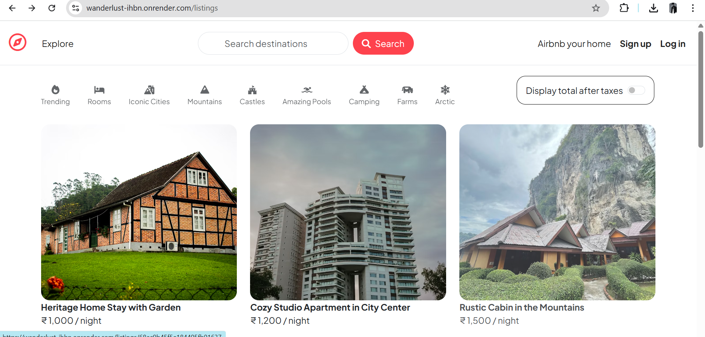
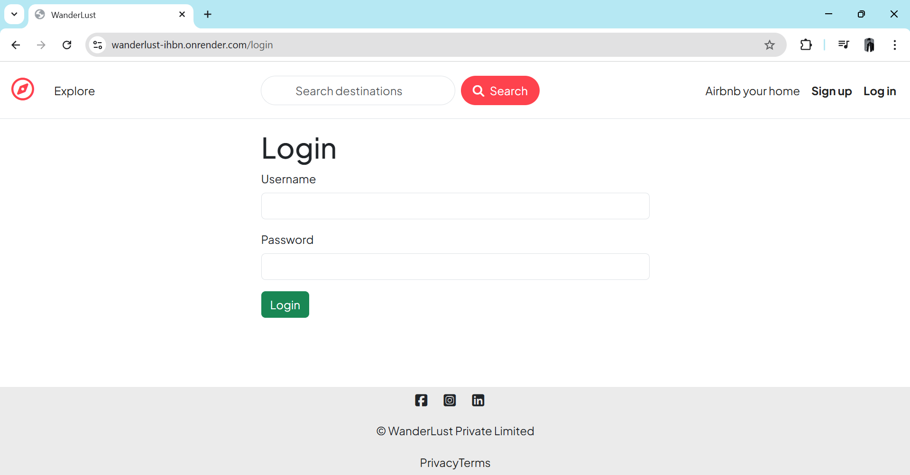
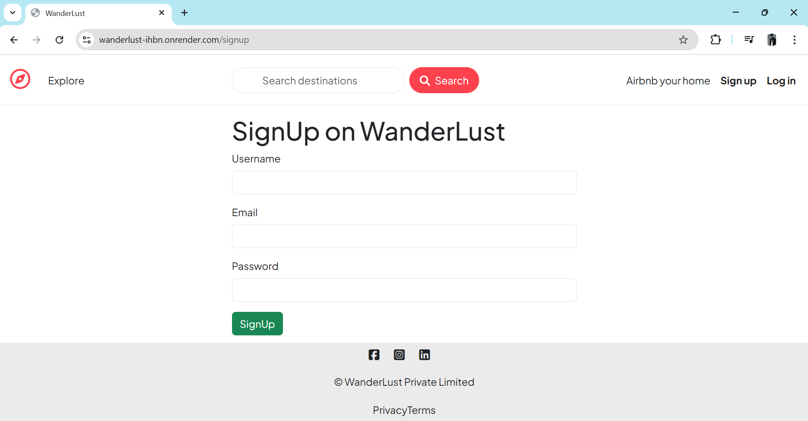
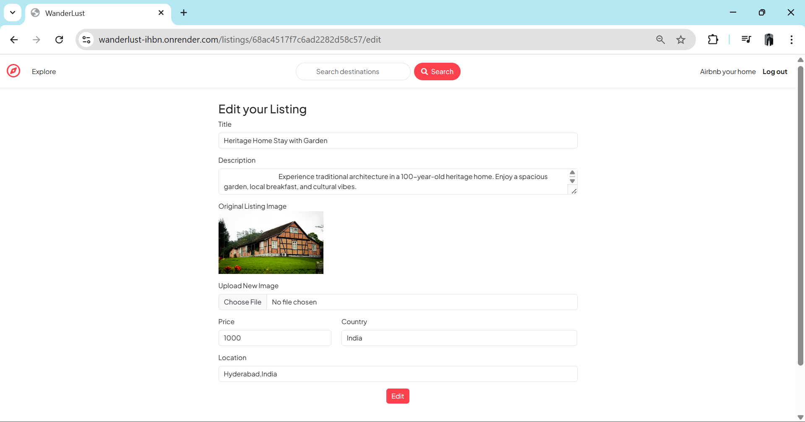
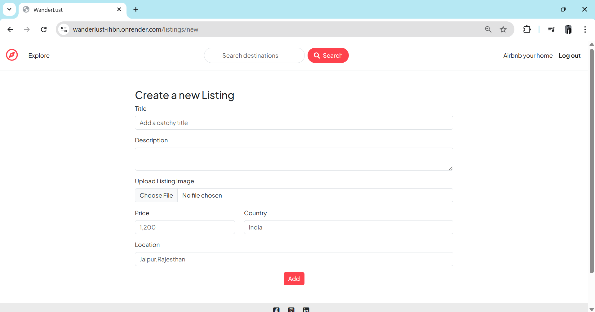
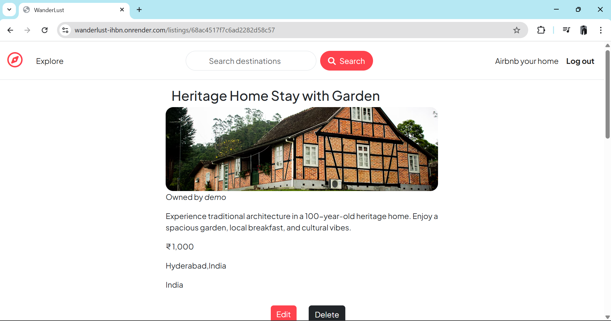
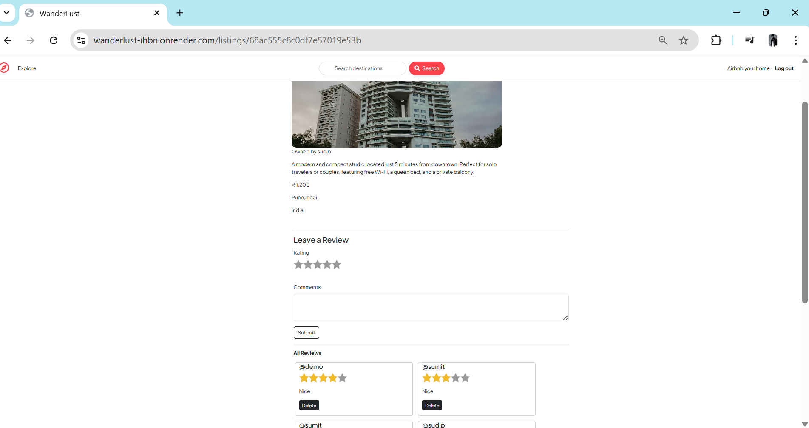
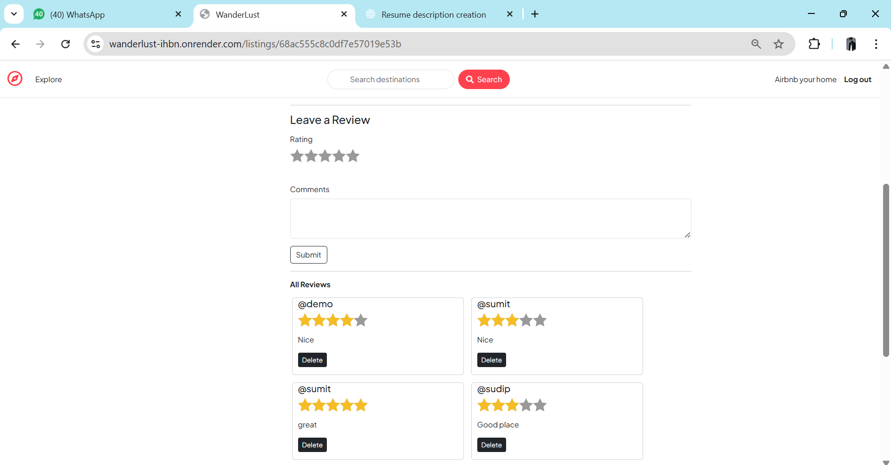
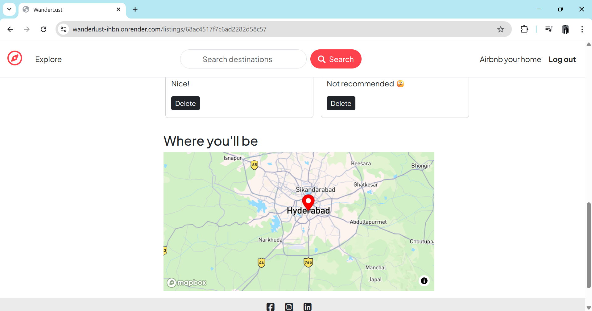

# WanderLust

WanderLust is a full-stack web application inspired by Airbnb, designed to provide users with a platform to explore, create, and manage travel listings. The project leverages modern web development technologies and cloud services to deliver a seamless and responsive user experience.

---

## Technologies Used

### Backend
- **Node.js**: Server-side JavaScript runtime for building scalable and efficient backend services.
- **Express.js**: Web framework for handling routing, middleware, and HTTP requests.
- **MongoDB Atlas**: Cloud-based NoSQL database for storing user data, listings, and reviews.
- **Mongoose**: Object Data Modeling (ODM) library for MongoDB, used for schema design and database interaction.
- **Passport.js**: Authentication middleware for user login and session management.
- **Joi**: Data validation library for validating user inputs and request payloads.
- **Cloudinary**: Cloud storage for managing and serving images uploaded by users.
- **Multer**: Middleware for handling file uploads, integrated with Cloudinary for image storage.

### Frontend
- **EJS (Embedded JavaScript)**: Templating engine for rendering dynamic HTML pages.
- **Bootstrap 5**: CSS framework for responsive and mobile-first design.
- **Font Awesome**: Icon library for enhancing the UI with scalable vector icons.
- **Custom CSS**: Additional styling for a unique and polished user interface.

### Geolocation
- **Mapbox**: Interactive maps and geocoding services for displaying listing locations and enabling map-based navigation.

### Middleware
- **connect-flash**: Flash messaging for user notifications (e.g., success and error messages).
- **method-override**: Enables HTTP verbs like PUT and DELETE in forms.

### Deployment
- **Render**: Cloud platform for deploying the application, ensuring scalability and reliability.
- **Environment Variables**: `.env` file for securely managing sensitive credentials (e.g., API keys, database URLs).

### Additional Features
- **Session Management**: Persistent user sessions using `express-session` and `connect-mongo`.
- **Error Handling**: Custom error classes and middleware for handling application errors gracefully.
- **Validation**: Server-side validation of user inputs using Joi to ensure data integrity.

## Key Features
- User authentication with signup, login, and logout functionality.
- Create, read, update, and delete (CRUD) operations for travel listings.
- Review system with ratings and comments for listings.
- Interactive maps to display listing locations.
- Flash messages for user feedback.
- Responsive design for optimal viewing on all devices.

---

## 🧩 Project Structure

- **`models`**: MongoDB schemas for `User`, `Listing`, and `Review`.
- **`routes`**: RESTful API routes for listings, reviews, and user authentication.
- **`controllers`**: Business logic for handling requests and responses.
- **`views`**: EJS templates for rendering dynamic pages.
- **`public`**: Static assets including CSS, JavaScript, and images.
- **`utils`**: Utility modules for error handling and asynchronous wrapper functions.


```bash
📦 WanderLust-Full-Stack-Web-Application
├── 📁 controllers/
├── 📁 init/
├── 📁 models/
├── 📁 public/
├── 📁 routes/
├── 📁 screenshots/
├── 📁 utils/
├── 📁 views/
├── .gitignore
├── app.js
├── cloudConfig.js
├── middleware.js
├── package-lock.json
├── package.json
├── README.md
└── schema.js

```

---

## How to Run Locally
1. Clone the repository.
2. Install dependencies using `npm install`.
3. Create a `.env` file with the following variables:

CLOUD_NAME=your_cloudinary_cloud_name 
CLOUD_API_KEY=your_cloudinary_api_key 
CLOUD_API_SECRET=your_cloudinary_api_secret 
MAP_TOKEN=your_mapbox_token 
ATLASDB_URL=your_mongodb_atlas_url 
SECRET=your_session_secret

4. Start the application using `node app.js`.
5. Access the application at `http://localhost:3000`.

---

## Live Demo
The application is deployed on Render. You can access it [here](https://wanderlust-ihbn.onrender.com/listings).

---

## 🖼️ Screenshots

### 🏠 Home Page


### 🔐 Login Page


### 📝 Signup Page


### ✏️ Edit Listing Page


### ➕ Add New Listing Page


### 📋 Listing Details Page

#### 📋 Listing Details



#### ⭐ Listing Review 


#### 📍 Listing Location 

